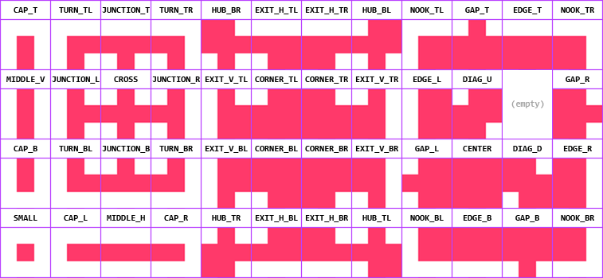
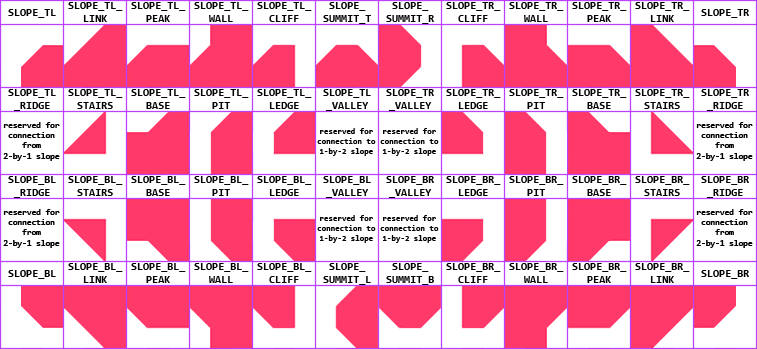
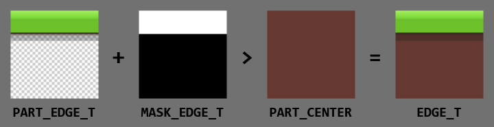

# Tileset Builder
A ZIP tileset texture importer & tile generator plugin for the Godot game engine (version 4.4). It can:
- Create standard 47-tile "blob" tilesets from a ZIP file that contains separate tile images, so you won't have to do this manually.
- Generate missing tiles by flipping, rotating or merging other tiles.
- Augment the tileset texture with an 88-tile slope tileset, which contains various connection tiles.
- Create tileset resources from imported ZIP archives with standard peering bits and physics shapes.

The images in the ZIP files must conform to specific filenames in order to be recognized (see the image below). Each tile can be provided as either a fully-finished image, or as "parts" images that will be used to generate the tile at import time.

## Install Guide
1. Create a folder called `Addons/ZipTilesetImporter`.
2. Extract the contents of this repository to that folder.
3. Enable the import plugin under `Project Settings` => `Plugins`.

## How to Use
After installing, create a ZIP file and fill it with image files, using the filenames in the image below.

Textures can be exported by clicking the "Export to file" button in the texture's inspector. You can also create a tileset from your imported texture by clicking the "Create tileset" button.

### Standard Tiles
This image shows you which tile each filename maps to:

For example, the file `archive.zip/NOOK_TR.png` would be used as the top-right outer corner tile.

### Slope Tiles
Normally, slopes will not be generated by the importer. However, if you include one of the following in your ZIP file, a slope block will be allocated below the standard tiles.

These are the relevant filenames:

### User-Defined Tiles
You can add custom tiles by adding images with filenames that are not in the image above. These tiles are placed below the standard tileset area. When you generate a tileset resource, user-defined tiles will not get their terrain or physics shape painted.

## Tile Generation
Tiles can be loaded from a ZIP archive in four ways, in the following order:
1. If the tile is present in the ZIP: load it directly.
2. If its parts are present in the ZIP: construct it from parts.
3. If its parts can be derived from other parts: construct it from derived parts.
4. If possible, derive it from other loaded tiles in the tileset.

This allows you to make your archive as complex as it needs to be. Please view the `Demo` folder for various tileset examples.

### Parts
Often, you don't want a tile to be directly loaded from a single image, but instead use a foreground and background image. If you prefix your tile image with `PART_`, the importer will treat as a foreground image, which will get overlayed on top of a background image (which is always the `CENTER` tile). You can control the compositing process on a per-pixel basis using a `MASK_` image.

For example:

Here, the `EDGE_T` tile is created by overlaying the `PART_EDGE_T` image over the `PART_CENTER` image. The `MASK_EDGE_T` controls how blending is done: white pixels replace the background pixels, while black pixels are alpha-blended with the background pixels.

Your tileset archives can have both prefab tiles and part images. If a tile has both a prefab image and part images available, then the prefab is always used (but the parts may still be used to generate other tiles).

## Planned Features
In order of priority:
- [Better Terrain](https://github.com/Portponky/better-terrain) terrain generation, as Godot 4's terrain system does not support slope autotiling.
- 1-by-2 slopes.
- 2-by-1 slopes.
- Adding the option for tile variants.
