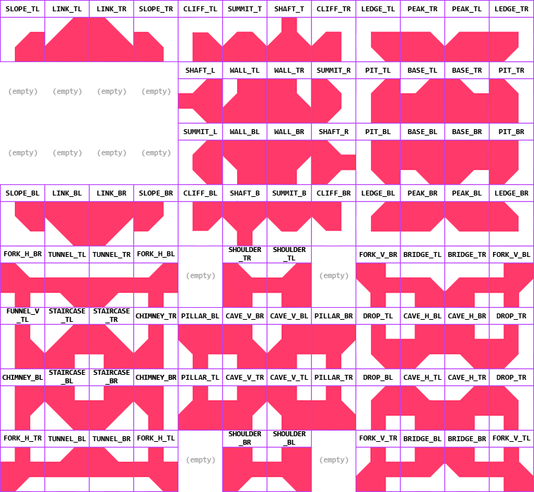

# Tileset Builder
A ZIP tileset texture importer & tile generator plugin for the Godot game engine (version 4.4). It can:
- Create standard 47-tile "blob" tileset textures from a ZIP file (containing tile images).
- Generate missing tiles by flipping, rotating or merging other tiles.
- Augment the tileset texture with an 88-tile slope block.
  - Long and tall slopes are also supported, as well as connections between different slope types.
- Export generated textures as PNG files.
- Generate tileset resources with painted terrain and physics shapes.
  - Supports the [better terrain](https://github.com/Portponky/better-terrain) plugin.

Each image in the ZIP corresponds to a tile. In order to be recognized, their filenames must conform to specific values (see the images below). Each tile can be provided as either a single image, or as a tile + mask image pair that will be used to build the tile at import time.

## Install Guide
1. Download the latest release from the 'Releases' page.
2. Create a folder called `Addons/TilesetBuilder`.
3. Extract the downloaded archive's contents to that folder.
4. Enable the plugin under `Project Settings` => `Plugins` => `Tileset Builder`.

## How to Use
After installing, create a ZIP file and fill it with image files, using the filenames in the images below.

The tile texture inspector contains two buttons:
- Export to file: saves the generated texture to a PNG file, so you can inspect or share it.
- Create tileset: creates a tileset resource from your texture, with default terrain and physics shapes already set up.

The `Demo` folder contains several example ZIP tilesets that you can take a look at.

### Standard Tiles
This image shows you which tile each filename maps to:

For example, the file `archive.zip/NOOK_TR.png` would be used as the top-right outer corner tile.

### Slope Tiles
Normally, slopes will not be generated by the importer. However, if you include one of the following in your ZIP file, a slope block will be allocated below the standard tiles.

Note that slope autotiling will not work unless you use the [better terrain](https://github.com/Portponky/better-terrain) plugin, as Godot's default terrain system is quite limited.

The slope tile filenames are as follows:

### Long & Tall Slope Tiles
Long slopes (or 2-by-1 slopes) use similar names as the regular slope tiles, with a few differences:
- All filenames must be prefixed with `LONG_`. So you use `LONG_LINK_TL` instead of `LINK_TL`.
- The main slopes are each divided into two tiles: `LONG_SLOPE_LOW_x` and `LONG_SLOPE_HI_x`, representing the bottom half and the top half respectively.

Tall slopes (or 2-by-1 slopes) work the same, but you use the prefix `TALL_` instead.

### Inter-Slope Link Tiles
When two or more types of slopes are included in the tileset, an extra block for is generated for connections between slopes of different types.

Their filenames are as follows:

### User-Defined Tiles
You can add custom tiles by adding images with filenames that are not in the image above. These tiles are placed below the standard and slope tileset blocks, in alphabetical order. When you generate a tileset resource, user-defined tiles will not get their terrain or physics shape painted.

### Variant Tiles
Often you want to have the ability to have multiple variations of common tiles. You can do this by adding a number to your filenames, for example `CENTER01.png`.

Variant tiles are painted with the same terrain and physics shape as the main tile, but have their probability set to 0. They are placed at the very bottom of the tileset.

## Tile Generation
Tiles can be loaded from a ZIP archive in three ways, in the following order:
1. If the tile AND its mask are present in the ZIP: composite it with the `CENTER` tile.
2. If only the tile is present in the ZIP: load it directly.
3. Otherwise, derive it (and its mask) from other loaded tiles in the tileset (if possible).

This allows you to make your archives as complex as they need to be. For example, if your `EDGE_T` and `EDGE_L` combine into an acceptable `NOOK_TL` tile, there's no need to include it in your archive.

### Masks
Often, you don't want a tile to be directly loaded from a single image, but use the `CENTER` tile as a background and overlay something on top of it. To do this, you must define a `MASK_` image.

For example:

Here, the final `EDGE_T` tile is created by overlaying the `EDGE_T` image over the `CENTER` image. The `MASK_EDGE_T` controls how blending is done: the white pixels replace the background pixels, and the black pixels are alpha-blended with the background pixels.

Mask images can be derived from other masks like regular tile images. However, masks will not be used for a tile if it's present in the ZIP archive, but does not explicitly define a mask image.

## Planned Features
- Making the generation process configurable in the import window: currently the process is completely fixed and untransparent, limiting its usefulness.

## Known Issues
When you create a tileset resource, delete it, and then create a different tileset with the same filename, the old tileset will still be used by the engine. Reloading the project fixes this.
